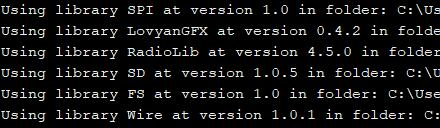

# Makerfas 3.5“ TFT Lora Controller

```c++
/*
Version:		V1.1
Author:			Vincent
Create Date:	2021/9/18
Note:
		V1.1 Add more description.
*/
```


[toc]

# Makerfabs

[Makerfabs home page](https://www.makerfabs.com/)

[Makerfabs Wiki](https://makerfabs.com/wiki/index.php?title=Main_Page)


# Lora Radio Expansion

## Intruduce

Product Link ：[]()

Wiki Link :  []()


LoRa Radio expansion based on the LoRa module and provided a wireless Lot solution (ESP32-LoRa). This board is designed for ESP32 3.5" TFT Touch with Camera (also for the 3.2" one), mainly used with the ESP32 3.5" TFT Touch board.

We used LoRa Radio expansion and  ESP32 3.5" TFT Touch with Camera to make a Lora control terminal, which can control multiple Lora devices at the same time through the touch screen and display the device status in real time.

It is an extension of Touch Screen Camera series.

[ESP32 TFT LCD with Camera(3.5'')](https://www.makerfabs.com/wiki/index.php?title=ESP32_TFT_LCD_with_Camera(3.5%27%27))

[ESP32 TFT LCD with Camera(3.2'')](https://www.makerfabs.com/wiki/index.php?title=ESP32_TFT_LCD_with_Camera(3.2%27%27))

## Feature

- Onboard LoRa module (433Mhz, 868Mhz or 915Mhz)
- Long communication distance: 2km or more
- Active buzzer
- Power by 3.3V

### Front:


### Back:


# Makerfas 3.5“ TFT Lora Controller

## Introduce

An open Lora control terminal that currently supports 6 Makerfabs of Lora nodes (some are not for sale).  Realizes UI interface, can increase sensor according to UID. And there are different control interfaces for different nodes. 

Five nodes can be online at the same time and the node status is updated periodically. 


## How to use

We're going to post a video to show you how to do that.

### Main page


The main page allows you to add nodes, clear all nodes, and enter receive mode.

The status of each logged node can be updated periodically.

And you can click the node button to enter the node interface.

### Node Page


In node page, you can view the node type, UID, and icon.

You can also refresh the node status periodically.

### Node Control Page


Some types of nodes have control functions, such as controlling the Relay switch and the size of AC Dimmer.

Click the button to enter the keypad or change the switch state.

# Code Explain

## Firmware

In .\firmware\ESP32TFT3.5-LORA

### Compiler Options

**If you have any questions，such as how to install the development board, how to download the code, how to install the library. Please refer to :[Makerfabs_FAQ](https://github.com/Makerfabs/Makerfabs_FAQ)**

- Install board : ESP32 .


- Install library: LovyanGFX, RadioLib



- Copy all bmp file to TF cards and insert to esp32
- Upload codes, select "ESP32 Wrover Module" and "Huge APP"

*Use other version board or library maybe not be able to complied.*


### Change Lora Frequency

Makerfas 3.5“ TFT Lora Controller main code. The default Lora frequency is 434 MHz, you can change these codes:

```c++
//In .\firmware\ESP32TFT3.5-LORA\makerfabs_pin.h

#define FREQUENCY 434.0
#define BANDWIDTH 125.0
#define SPREADING_FACTOR 9
#define CODING_RATE 7
#define OUTPUT_POWER 10
#define PREAMBLE_LEN 8
#define GAIN 0
```

## Example Nodes

We have provided some node routines for demonstration purposes, some of which are not yet available for sale in beta. But the instruction system is broadly compatible.